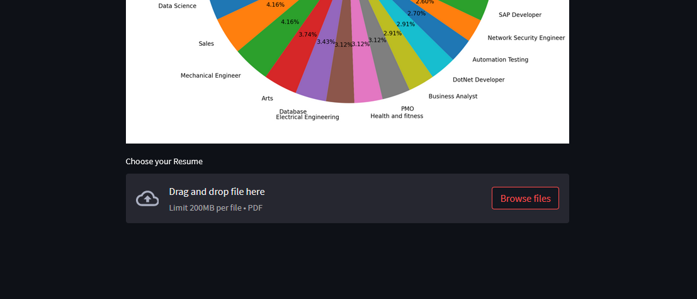
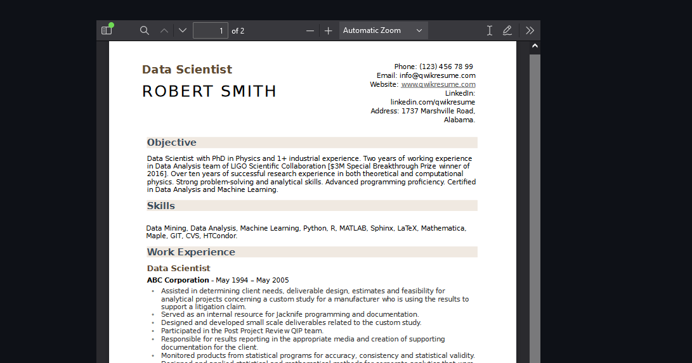
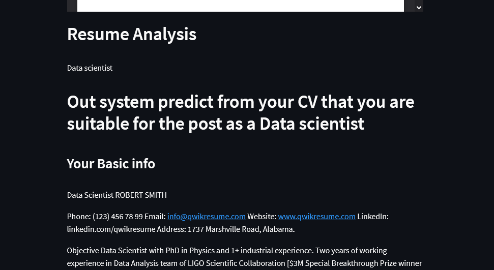

# CV_analysis_ML

## Introduction
We build a CV analysis system for a particular organization to ease their recruitment.
<ul>

<li>An organization will have a dataset of requirement entities where our Machine Learning model will be trained.</li>
<li>There will be a user interface where a CV is provided  for evaluation.</li>
<li> The Interface takes a CV in PDF format and predicts which position the candidate is suitable for. </li>
<li> overall this system is built from a recruiter’s perspective.</li>

</ul>

## Project Description
Our project includes two portions namely:

<ul>

<li> The Python implementation of the system in Google Colab. </li>
<li> The user Interface was developed with Streamlit.</li>

</ul>

### Dataset
We used “UpdatedResumeDataSet.csv” from Kaggle and it has two features such as Category (Job positions) & Resume.

### Data Cleaning & Vectorization & lebel encoding

<ul>

<li> The dataset was cleaned using the Python Regex module.The cleaned data was added to the 'clean text' feature. </li>
<li> The category of job positions were encoded to numericals by the lebel encoder module.</li>
<li> 'Clean text' Features of the dataset were vectorized using TfidfVectorizer with a maximum of 2000 features. </li>
</ul>

### Model Selection & training & testing

<ul>

<li> We used  KNeighborsClassifier as OneVsrestClassifier for training 769 data items and tested on 193 data samples. </li>
<li> We got an accuracy of 98% in this approach so we decided to use this model to take a single CV as an input and predict which job position the candidate is suitable for.</li>

</ul>

### Integration with frontend

<ul>

<li>We integrated Streamlit with Colab using Pyngrok. </li>
<li> The frontend has an input field where a CV is taken as an input PDF file and processed through the system to generate results.</li>

</ul>

# Some Screenshots:

 

 

 

 

## Developed by,
- <b>[ Abhishek Dey (2017331021)](https://github.com/ABHISHEK-DEY-64150)</b>
- <b>[Sani Talukder (2017331023)](https://github.com/sani-1023)</b>

